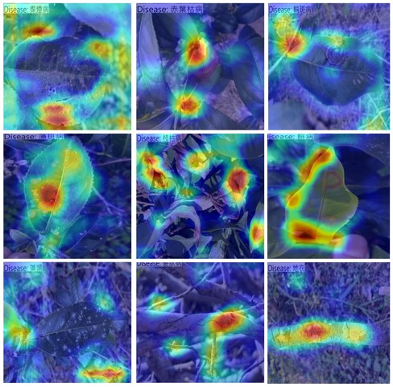

# 茶樹病害影像辨識模型原始專案說明

## 介绍

> 茶樹病害影像辨識模型

團隊利用FastAI開發茶樹的病害影像辨識模型，利用實際田間徵狀照片與人工標註徵狀位置之茶樹資料集訓練出此模型。

## 功能

此茶樹的病害影響辨識模型能夠協助並快速的辨識茶樹病害種類

## 呈現效果

> 輸入欲檢測的茶樹徵狀照片，即可知道該徵狀是屬於哪種茶樹病害

|                       原始圖片(茶樹徵狀照片)                       |                          推論結果(模型判斷病害結果)                           |
| :--------------------------------------------------------------: | :---------------------------------------------------------------------: |
|  |  |
|  |  |

## 模型

> 以ResNet-34 模型架構為基礎進行訓練。
> 通過添加自定義的多標籤分類指標，並使用學習率查找和微調技術來優化模型的訓練過程。

> 另外使用Gradcam 做AI可視化

### 模型架構

模型採用了以下架構 :

> ResNet34：

- 預訓練的深度卷積神經網絡（CNN）3。
- ResNet34 使用殘差塊（Residual Blocks），能夠在更深的網絡中保持較好的性能，並且避免梯度消失問題。

> 多標籤分類：

- 多標籤分類是一種分類任務，其中每個樣本可以屬於多個類別。
- 使用自定義的精確度、召回率和 F1 分數作為評估指標

### 訓練方式

模型是使用以下方式進行訓練 :

> 自定義評估指標：
- 使用 sklearn 的函數計算precision_multi, recall_multi, 和 f1_score_multi 三個自定義指標。
- AccumMetric 用於在多個 batch 上累積計算指標
- partial 用於設置固定的閾值（0.8）
 
> 學習器（Learner）創建 :
-使用 vision_learner 函數創建一個學習器物件。
-用'to_fp16()'提高計算效率和減少內存使用。

> 學習率查找：
- 使用 learn.lr_find() 查找最佳學習率
- 使用 learn.recorder.plot_lr_find() 繪製學習率查找器曲線，幫助決定最佳學習率。

> 模型微調：
- 使用 learn.fine_tune(6, freeze_epochs=4, base_lr=1e-3) 進行微調。
- freeze_epochs=4 表示在前 4 個 epoch 中，只有最後的全連接層會被訓練，之前的層將保持凍結狀態。
- 之後的 2 個 epoch，所有層都會被訓練。
- 使用Early Stopping Callback，防止模型過擬合的技術。

> 模型設定和參數（根據 fastai 的默認設定）

- 訓練數據: 使用平台的茶樹病害徵狀資料集
- 損失函數: [二元交叉熵损失（BCEWithLogitsLoss）]
- 優化器: [Adam]
- 訓練批次大小: [32]

### 預訓練權重

- 使用FastAI時，vision_learner會自動下載並使用來自PyTorch的預訓練模型權重。
- 創建vision_learner時設置pretrained=True，它會自動加載預訓練權重。

### 模型評估

模型經過評估，並在測試數據上達到以下性能 :

- 精度: [73 %]
- 召回率: [66 %]
- F1 分數: [89 %]

### 模型可視化

使用 Grad-CAM 技術進行視覺化，以產生模型對茶樹病害徵狀區域的注意力熱圖，並進行解釋。

|   層    |                                 圖片                                  |
| :-----: | :-------------------------------------------------------------------: |
|  side7  |      |

### 模型穩定性

> AI 模型對於輸入數據的變化或干擾的抵抗能力，可以對資料進行一些擾動來檢測模型的穩定性

對於內部資料集驗證（進行對抗樣本測試）
|                   對抗樣本(茶樹徵狀照片)                        |                            推論結果(模型判斷病害結果)                       |
| :--------------------------------------------------------: | :----------------------------------------------------------------: |
|  |  |

對於外部資料集驗證
|                   外部資料集(茶樹徵狀照片)                    |                          推論結果(模型判斷病害結果)                   |
| :----------------------------------------------------: | :----------------------------------------------------------: |
|  |  |

### 模型公平性

> 檢查訓練數據，確保它們不包含明顯的偏見或不平等，可以使用第三方函式庫檢驗模型的公平性

## 資料集

> 使用自行蒐集的資料集，該資料為田間實際茶樹病害照片

資料集內容描述：
> Tea plant nutrient, disease and pest symptom image dataset (茶樹營養，病蟲害徵狀影像資料集)
> 關於此資料集的詳細說明請點選[茶樹營養，病蟲害徵狀影像資料集](https://aidata.nchu.edu.tw/smarter/dataset/smarter_04_t14088_0_tead_20220826_img1_t14088)

> 在執行模型訓練之前，有先使用OpenCV 套件及自編碼器做資料品質檢測
> 由於田間徵狀照片的近照會有徵狀清楚但是背景模糊問題，因此在OpenCV篩選時，只有使用亮度是否有異常做篩選

## 自訂資料集

> 要注意標註檔病害的代碼，更多標註檔的細節可以參考資料集的詳細說明
> 資料格式為JPG、資料標籤請參考標註檔代碼
> 影像檔與標註檔放於同一資料夾，若是分開資料夾，請修改程式碼中path的部分
> labelimg_path = "D:/imgdata/Tea/Disease/"  # 圖片文件夾，請修改成你的檔案位置
> xmlfile_path = "D:/imgdata/Tea/Disease/"  # XML標註文件夾，請修改成你的檔案位置

## 安裝

> 使用前請先安裝好 [Anaconda](https://www.anaconda.com/download)。
> 請建立FastAI的虛擬環境

### Anaconda

> 匯入本專案提供的FastAI.yml檔案，以建立FastAI的Python 虛擬環境
> Python 虛擬環境，Python 版本 >= 3.8
> 下載 [FastAI.yaml](https://github.com/Nchuai04/Tea-disease-identification-model/blob/main/fastai.yaml)。
> 直接開啟Anaconda，使用import功能建立FastAI虛擬環境。

## 使用說明

> 請先開啟FastAI虛擬環境的Terminal
> 進入到有.ipynb檔案的目標資料夾
    cd "D:/imgdata/Tea/Disease/"
> 進入jupyter notebook，並開啟.ipynb執行資料品質篩選以及AI模型訓練 
	jupyter notebook

> 注意！若無提供使用相關說明，使用者下載原始專案後會不知道該怎麼使用

### 原始碼

> 資料品質篩選程式碼，請參考 [GitHub](https://github.com) 參考。
> AI影像辨識訓練程式碼，請參考 [GitHub](https://github.com) 參考。

## 參考文獻

> 如果你想深入研究模型架構或相關技術，可以參考以下參考文獻 :

- Pytorch, ResNet-34 
- Reference:
  He, K., Zhang, X., Ren, S., & Sun, J. (2016). Deep residual learning for image recognition. In Proceedings of the IEEE conference on computer vision and pattern recognition (pp. 770-778).

- Code Implementation:
  https://www.kaggle.com/code/fmussari/fast-resnet34-with-fastai

## 聯絡方式

> 聯絡人 : 蘇湄琇

> Email : ms2977@dragon.nchu.edu.tw

